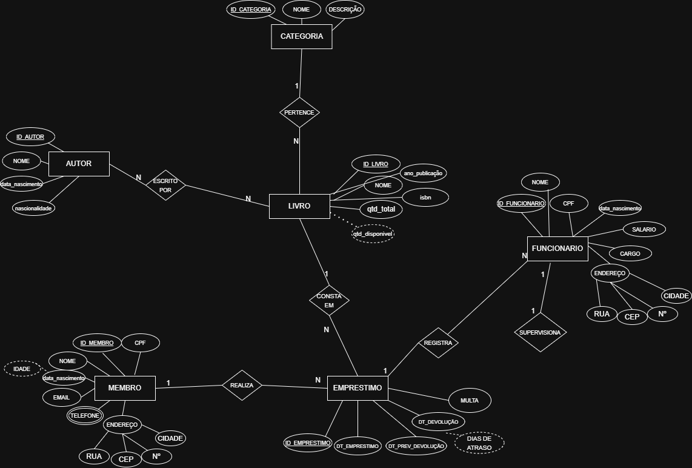
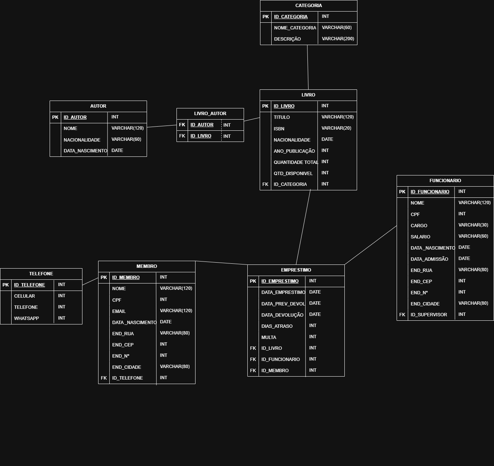

# 📚 Biblioteca Saber Livre — Banco de Dados

> Projeto de Modelagem de Banco de Dados desenvolvido para a disciplina de Modelagem de Banco de Dados.  
> Sistema de gerenciamento de uma biblioteca pública, contemplando acervo, membros, funcionários e empréstimos.

---

## 📋 Índice

1. [Cenário](#1-cenário)
2. [Modelagem Conceitual](#2-modelagem-conceitual)
3. [Modelagem Lógica](#3-modelagem-lógica)
4. [Modelagem Física](#4-modelagem-física)
5. [CRUD](#5-crud)
6. [Relatórios](#6-relatórios)

---

## 1. Cenário

A **Biblioteca Saber Livre** é uma instituição pública com acervo de mais de 2.000 títulos entre livros e materiais de referência. A biblioteca atende estudantes, pesquisadores e a comunidade em geral, oferecendo serviços de consulta local e empréstimo domiciliar.

Para modernizar a gestão, a biblioteca conta com um sistema informatizado que controla seu acervo completo, os cadastros de membros e funcionários, e todas as operações de empréstimo e devolução. O sistema garante rastreabilidade de cada exemplar e automatiza o cálculo de multas por atraso.

O cenário completo está disponível em: [`1-Cenario Banco de Dados.pdf`](1-Cenario%20Banco%20de%20Dados.pdf)

### Entidades e Atributos

**Livro:** Cada livro tem seu próprio identificador, seu título, ano de publicação, categoria, autor, ISBN e quantidade de exemplares disponíveis. Um livro pode ter mais de um autor.

**Autor:** Cada autor tem seu ID, nome, nacionalidade e data de nascimento. Um autor pode ter vários livros publicados.

**Categoria:** Cada categoria possui ID, nome e descrição. Cada categoria tem seu acervo de livros.

**Membro:** Cada membro tem seu ID, nome, CPF, email, data de nascimento, telefones e endereço (cidade, CEP, rua, número, bairro). Um membro pode pegar mais de um livro por vez.

**Empréstimos:** Os empréstimos têm seu ID, data de empréstimo, data prevista para devolução, data de devolução e dias de atraso. Cada empréstimo pertence a um único membro e a um livro específico, mas ao longo do tempo um mesmo livro pode aparecer em muitos empréstimos.

**Funcionários:** Cada funcionário conta com ID pessoal, nome, CPF, email, data de nascimento, endereço (cidade, CEP, rua, número, bairro), cargo, salário e data de admissão. Um funcionário pode registrar muitos empréstimos, e cada empréstimo é registrado por um funcionário. Cada funcionário tem no máximo um supervisor direto, que também é funcionário da biblioteca — auto-relacionamento.

### Tipos de Atributos utilizados

| Tipo | Exemplo |
|------|---------|
| **Chave** | `id_livro`, `id_membro`, `id_funcionario` |
| **Simples** | `titulo`, `isbn`, `nome`, `cargo`, `salario` |
| **Composto** | `endereco` → rua, número, cidade, CEP |
| **Multivalorado** | `telefones` (um membro pode ter vários) |
| **Derivado** | `dias_atraso` (calculado a partir das datas), `qtd_disponivel` |

### Tipos de Relacionamentos utilizados

| Tipo | Relacionamento |
|------|---------------|
| **1:1** | Funcionário `SUPERVISIONA` Funcionário (auto-relacionamento) |
| **1:N** | Categoria → Livro |
| **1:N** | Membro → Empréstimo |
| **1:N** | Livro → Empréstimo |
| **1:N** | Funcionário → Empréstimo |
| **N:N** | Livro ↔ Autor (via tabela `livro_autor`) |

---

## 2. Modelagem Conceitual

O Diagrama Entidade-Relacionamento (DER) foi construído seguindo as regras do Modelo Entidade-Relacionamento (MER), com entidades representadas por retângulos, atributos por elipses e relacionamentos por losangos.



### Destaques do DER

- **Atributo derivado** `qtd_disponivel` (elipse tracejada) em LIVRO e `dias_atraso` em EMPRÉSTIMO
- **Atributo multivalorado** `telefone` em MEMBRO (elipse dupla)
- **Atributo composto** `endereco` decomposto em rua, CEP, número e cidade em MEMBRO e FUNCIONÁRIO
- **Auto-relacionamento** 1:1 em FUNCIONÁRIO (`SUPERVISIONA`)
- **Relacionamento N:N** entre LIVRO e AUTOR, resolvido pela tabela associativa `livro_autor`

---

## 3. Modelagem Lógica

O Modelo Lógico foi derivado do DER, com definição dos tipos de dados, chaves primárias (PK) e chaves estrangeiras (FK) para cada tabela.



### Tabelas geradas

| Tabela | Descrição |
|--------|-----------|
| `categoria` | Classificações temáticas dos livros |
| `autor` | Dados dos autores cadastrados |
| `livro` | Acervo da biblioteca com FK para categoria |
| `livro_autor` | Tabela associativa N:N entre livro e autor |
| `membro` | Usuários cadastrados com endereço composto |
| `membro_telefone` | Telefones dos membros (atributo multivalorado) |
| `funcionario` | Colaboradores com auto-relacionamento de supervisor |
| `emprestimo` | Registros de retirada com FK para membro, livro e funcionário |

### Decisões de modelagem

- O **atributo composto** `endereco` foi expandido em colunas separadas: `end_rua`, `end_numero`, `end_cidade`, `end_cep`
- O **atributo multivalorado** `telefones` virou tabela própria `membro_telefone`, pois bancos relacionais não aceitam múltiplos valores em uma célula
- Os **atributos derivados** `dias_atraso` e `quantidade_disponivel` são calculados via views SQL, sem armazenar valor fixo
- O **auto-relacionamento** de supervisor é representado pela coluna `id_supervisor` que referencia o próprio `id_funcionario` da mesma tabela

---

## 4. Modelagem Física

Implementação do banco de dados utilizando **SQL no Supabase (PostgreSQL)**.

O script de criação está disponível em: [`4-MODELAGEM FISICA`](4-MODELAGEM%20FISICA)

### Criação das Tabelas

O script `biblioteca_schema.sql` cria as 8 tabelas na ordem correta respeitando as chaves estrangeiras, além de 2 views para os atributos derivados.

)

### Inserção de Dados

O script de inserção está disponível em: [`5-INSERÇÃO DE DADOS`](5-INSER%C3%87%C3%83O%20DE%20DADOS)

O script insere no mínimo 50 registros em cada tabela.


### Resumo dos dados inseridos

| Tabela | Registros |
|--------|-----------|
| `categoria` | 50 |
| `autor` | 50 |
| `funcionario` | 50 |
| `livro` | 50 |
| `livro_autor` | 50 |
| `membro` | 50 |
| `membro_telefone` | 50 |
| `emprestimo` | 50 |

---

## 5. CRUD

Demonstração das quatro operações básicas do banco de dados, executadas no SQL Editor do Supabase.

O script completo está disponível em: [`6-CRUD`](6-CRUD)

---

### C — Create (Inserção)

Exemplo: inserção de um novo livro no acervo e registro de um novo empréstimo.


---

### R — Read (Consulta)

Exemplo: listagem de todos os livros com suas respectivas categorias usando JOIN.


---

### U — Update (Atualização)

Exemplo: registro de devolução de empréstimo com cálculo automático de multa por atraso.


---

### D — Delete (Exclusão)

Exemplo: remoção segura de membro cadastrado incorretamente, com verificação de empréstimos vinculados via `NOT EXISTS`.


---

## 6. Relatórios

10 consultas SQL com `SELECT`, `WHERE`, `ORDER BY` e JOINs entre tabelas, evidenciando os relacionamentos do modelo.

O script completo está em: [`7-RELATORIOS`](7-RELATORIOS)


### Lista de relatórios

| Nº | Título | Técnicas utilizadas |
|----|--------|---------------------|
| 01 | Acervo completo com categorias e autores | JOIN, GROUP BY, STRING_AGG |
| 02 | Empréstimos em aberto com dias de atraso | WHERE IS NULL, GREATEST(), atributo derivado |
| 03 | Ranking de livros mais emprestados | COUNT, SUM, HAVING |
| 04 | Membros com mais empréstimos e multas | CASE WHEN, COALESCE |
| 05 | Funcionários, empréstimos e supervisores | Self JOIN (auto-relacionamento 1:1) |
| 06 | Disponibilidade do acervo por categoria | VIEW derivada, SUM, GROUP BY |
| 07 | Empréstimos com multa — histórico detalhado | 3 JOINs, COALESCE, WHERE multa > 0 |
| 08 | Autores com mais títulos no acervo | N:N, STRING_AGG DISTINCT, HAVING |
| 09 | Membros e seus telefones | Multivalorado, STRING_AGG |
| 10 | Resumo mensal de empréstimos | TO_CHAR, CASE WHEN, COUNT DISTINCT |

---

## 🗂️ Estrutura do repositório

```
📁 Biblioteca-Saber-Livre/
├── README.md
├── 1-Cenario Banco de Dados.pdf
├── 2-MODELO_CONCEITUAL.png
├── 3-MODELO_LOGICO.png
├── 4-MODELAGEM FISICA
├── 5-INSERÇÃO DE DADOS
├── 6-CRUD
├── 7-RELATORIOS
└── PRINTS/
    ├── PRINT-MODELAGEM FISICA/
    ├── PRINT-INSERÇÃO DE DADOS/
    ├── PRINT-CRUD/
    │   ├── CREATE/
    │   ├── READ/
    │   ├── UPDATE/
    │   └── DELETE/
    └── PRINT-RELATORIOS/
```

---

## 🛠️ Tecnologias utilizadas

- **PostgreSQL** via [Supabase](https://supabase.com)
- **SQL** — DDL, DML, DQL
- Modelagem com notação **MER/DER**

---

*Projeto desenvolvido para a disciplina de Modelagem de Banco de Dados.*
